# palega — EGA Palette Swapper TSR for DOS

**palega** is a small DOS TSR that intercepts **EGA palette BIOS calls**  
(INT 10h, AH=10h, AL=02h) and replaces the game’s palette with a custom one.

This allows you to recolor classic EGA games in real time — without modifying the game files — simply by loading a TSR before launching the game.

palega works on:
 - **DOSBox-X** (tested)
 - **86Box** (tested)
 - **FreeDOS** (tested)
 - **Real MS-DOS hardware**
 - Any emulator that performs **true BIOS INT 10h palette calls**

---

## Features

- Hooks **INT 10h EGA palette writes**
- Replaces the game’s palette with a custom `.pal` file
- Works with many real‑mode EGA games
- TSR stays resident and applies palette changes automatically
- Very small memory footprint
- Compatible with DOSBox‑X, 86Box, FreeDOS, and real MS‑DOS

---

## Screenshots

### Commander Keen 1 — Original vs Palega

| Original | Palega |
|----------|--------|
| 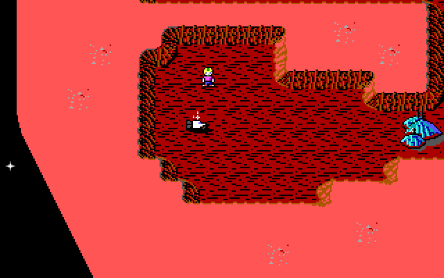 | 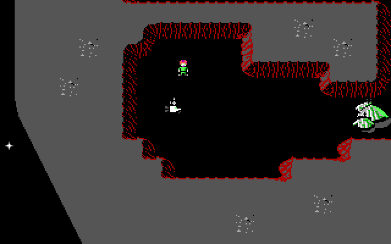 |
| 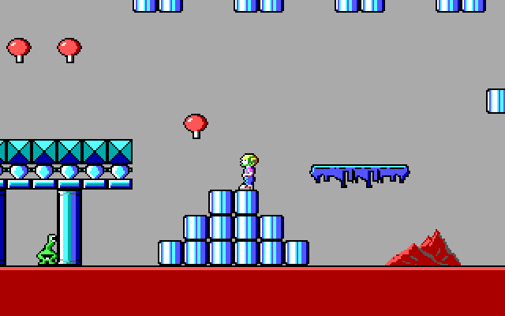 | 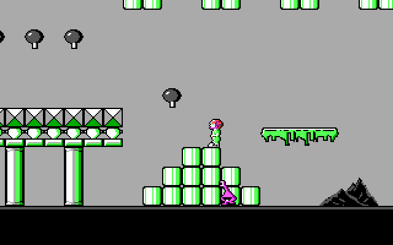 |
| 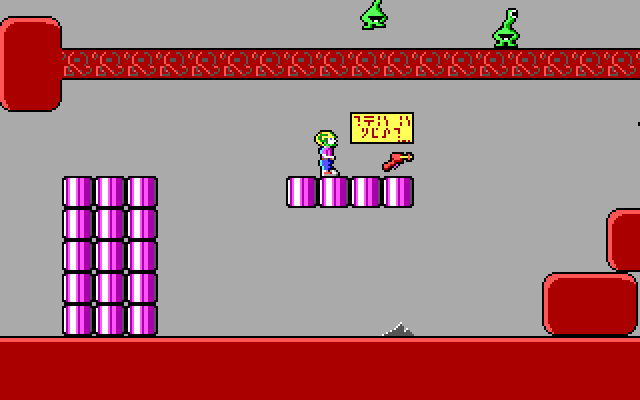 | 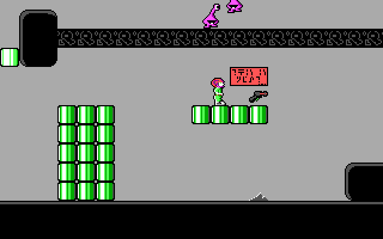 |

*Palette used: `keen.pal`*

### Might & Magic II — Original vs Palega

| Original | Palega |
|----------|--------|
| 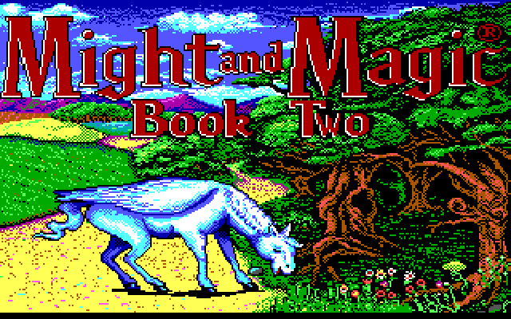 | 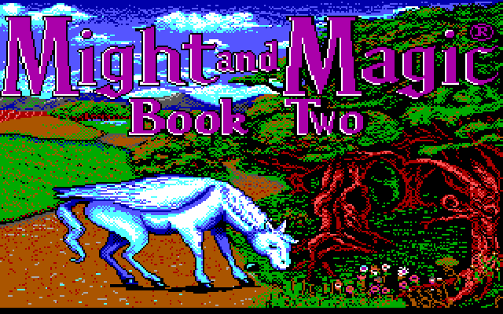 |
| 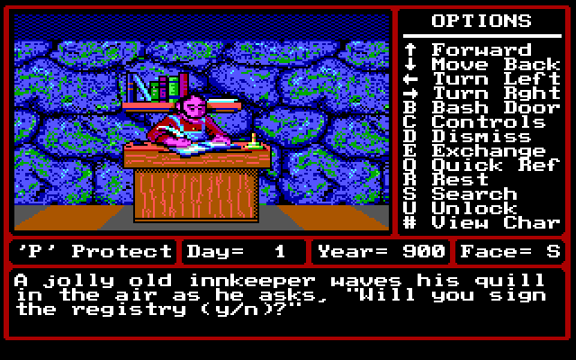 | 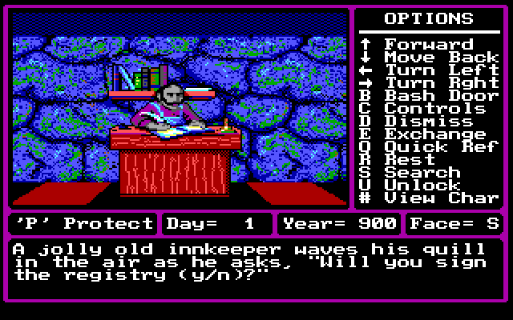 |
| 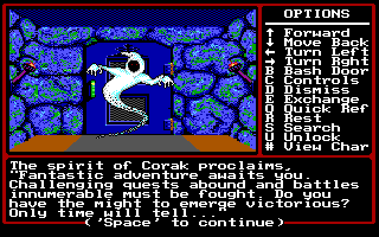 | 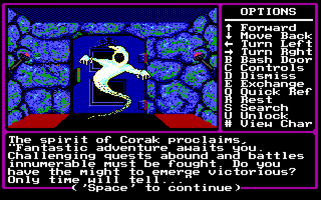 |
| 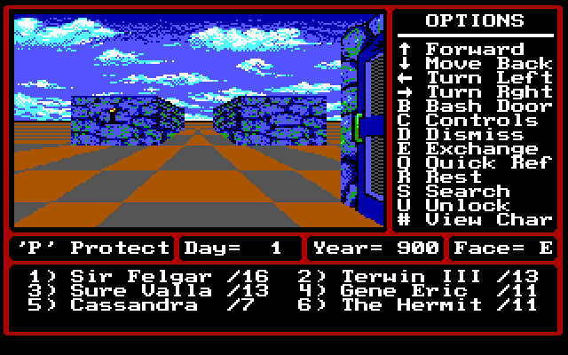 | 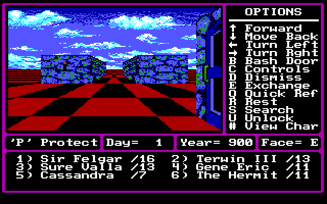 |

*Palette used: `mm2.pal`*

---

## How It Works

EGA games typically set their palette using BIOS interrupt:

```
INT 10h
AH=10h (palette functions)
AL=02h (set all palette registers)
```

palega hooks this interrupt and substitutes your custom palette whenever a
game attempts to load its own.
Note: Not *all* EGA games do this, see `game_list.txt` for a compability list of
games confirmed to work with palega.

## Palette File Format (`.pal`)

palega uses a simple binary palette format designed for EGA hardware.  
Each `.pal` file is **exactly 17 bytes**:

- **Bytes 0–15** — EGA palette registers (16 colors)
- **Byte 16** — Border (overscan) color

There is no header or metadata — just raw palette values.

### Byte Layout

```
Offset  Size  Description

0x00    1     Palette color 0
0x01    1     Palette color 1
...
0x0F    1     Palette color 15
0x10    1     Border color
```

### Value Range

Each byte is a **6‑bit EGA color value** in the range:

```
00h–3Fh  (0–63 decimal)
```

Bit layout:

- Bits **0–1** → Red (0–3)
- Bits **2–3** → Green (0–3)
- Bits **4–5** → Blue (0–3)

### Example `.pal` File (Hex Dump)

```
00 02 05 07 08 0A 0C 0F
10 12 15 17 18 1A 1C 1F
00
```

This represents:

- 16 palette entries  
- Border color = `00h`  
- Total size = **17 bytes**

### Using Custom Palettes

You can test palega easily using **Commander Keen 1 Shareware**, which is freely available and legal to redistribute.

Example:
```
C:\GAMES\KEEN> PALEGA.EXE KEEN.PAL
C:\GAMES\KEEN> KEEN1.EXE
```
### Palette File Location

If you provide a filename **without a path**, palega searches:

1. **Current working directory**  
2. **`pal/` subdirectory** (relative to the working directory)
3. Will automatically append .pal filename.
